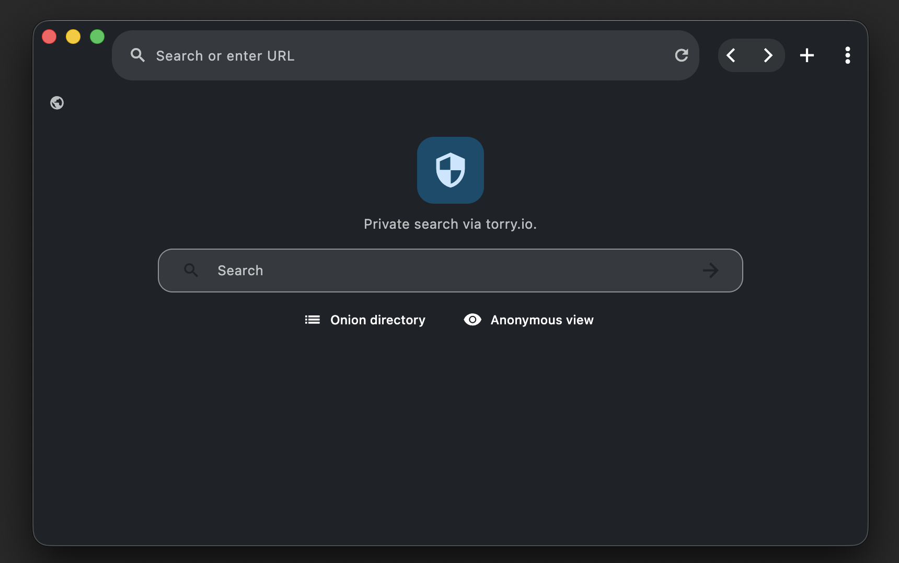

| **`CI`** | **`Flutter`** |
|:--------- |:------------ |
| [](https://github.com/bniladridas/browser/actions/workflows/lint.yml) | [](https://github.com/bniladridas/browser/actions/workflows/flutter.yml) |

# Browser



Flutter desktop web browser with tabs, bookmarks, history, and encrypted settings storage. One codebase covers macOS, Windows, Linux, and platform-specific Firebase integrations.

## Quick start

Clone the repo, install dependencies, and launch the macOS bundle.

```bash
git clone https://github.com/bniladridas/browser.git
cd browser
flutter pub get
cp .env.example .env  # populate Firebase values before running
flutterfire configure --platforms macos
git checkout -- lib/firebase_options.dart  # keep runtime env vars
flutter run -d macos
```

Do not commit `.env`; it contains private Firebase keys.

## Firebase configuration

All Firebase values live in `.env`. The app expects the variables at runtime so the generated `lib/firebase_options.dart` remains under version control and references `const String` placeholders.

<details>
<summary>To regenerate platform files after changing Firebase config</summary>

1. Update `.env` with the new Firebase project credentials.
2. Run `flutterfire configure --platforms macos` to refresh the generated files.
3. Immediately run `git checkout -- lib/firebase_options.dart` to revert the generated file back to the version that references environment variables.
4. Restart `flutter run` to pick up the new settings.

macOS additionally requires `macos/Runner/GoogleService-Info.plist`; `flutterfire configure` creates it automatically, or copy it from your Firebase console. Confirm the plist lives next to the generated macOS runner, and keep `.env.example` as a template for local copies so you can safely generate new `.env` files with valid credentials.

</details>

## Development

- Requires Flutter >=3.0.0 and the desktop toolchains for the target platforms.
- Run `./check.sh` to apply formatting, lint, and build checks shared across platforms.
- Build the signed macOS app with `flutter build macos` and adjust profiles with Xcode if needed.
- If you hit missing Firebase credentials while targeting macOS, double-check that `.env` is populated before launching the app.

## Keyboard shortcuts

Keys are defined in `lib/utils/keyboard_utils.dart` with platform-neutral aliases.

| Key | Action |
| --- | ------ |
| `[` / `LogicalKeyboardKey.bracketLeft` | Move to the previous tab |
| `]` / `LogicalKeyboardKey.bracketRight` | Advance to the next tab |
| `Left Arrow` / `LogicalKeyboardKey.arrowLeft` | Navigate backwards in history |
| `Right Arrow` / `LogicalKeyboardKey.arrowRight` | Navigate forwards in history |
| `R` / `LogicalKeyboardKey.keyR` | Reload the current tab |
| `T` / `LogicalKeyboardKey.keyT` | Open a new tab |
| `Escape` / `LogicalKeyboardKey.escape` | Close dialogs or stop loading |
| `Tab` / `LogicalKeyboardKey.tab` | Focus the address bar or tool strip |

Modifier keys include `Meta` (Cmd on macOS), `Control`, `Alt`, and `Shift`.

## macOS unsigned installs (no paid Developer ID)

Unsigned builds trigger Gatekeeper warnings. The first launch steps keep the workflow entirely within the Finder UI:

1. Drag `browser.app` to **Applications**.
2. Right-click `browser.app`, choose **Open**, and confirm the dialog.
3. Alternatively, open **System Settings → Privacy & Security** and click **Open Anyway** for `browser.app`.

For automation, bypass Gatekeeper for the binary with:

```bash
xattr -rd com.apple.quarantine /Applications/browser.app
```

Only run the command if you trust the build source.

## Need help?

- `docs/` contains tutorials, architecture notes, and troubleshooting guides.
- `.codex/README.md` documents toolchains, skills, and local workflows.
- Report bugs or feature requests via [GitHub Issues](https://github.com/bniladridas/browser/issues).

## Generated files

`.gitattributes` marks generated files so GitHub hides them from diffs and stats. Common generated paths include:

- `build/**` and `.dart_tool/**`
- `lib/**/*.freezed.dart` and `lib/**/*.g.dart`
- Platform artifacts such as `android/**`, `ios/**`, `macos/**`, `linux/**`, and `windows/**`

When a specific file should be shown in diffs, add `-linguist-generated` to `.gitattributes` for that path.

## Contribute

Fork, create a branch, run the checks, then open a pull request with a descriptive conventional commit-style summary. Follow repository tooling (`./check.sh`, GitHub Actions) before submitting.

## License

This project is proprietary. See `LICENSE` for the full terms.

Copyright (c) 2026 Niladri Das (bniladridas). All Rights Reserved.
